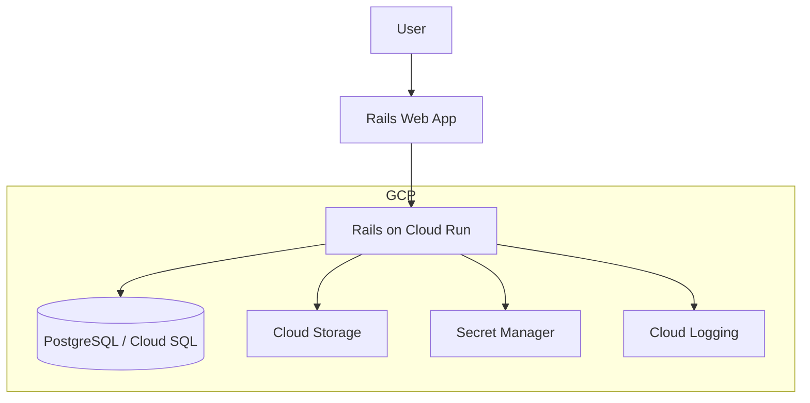
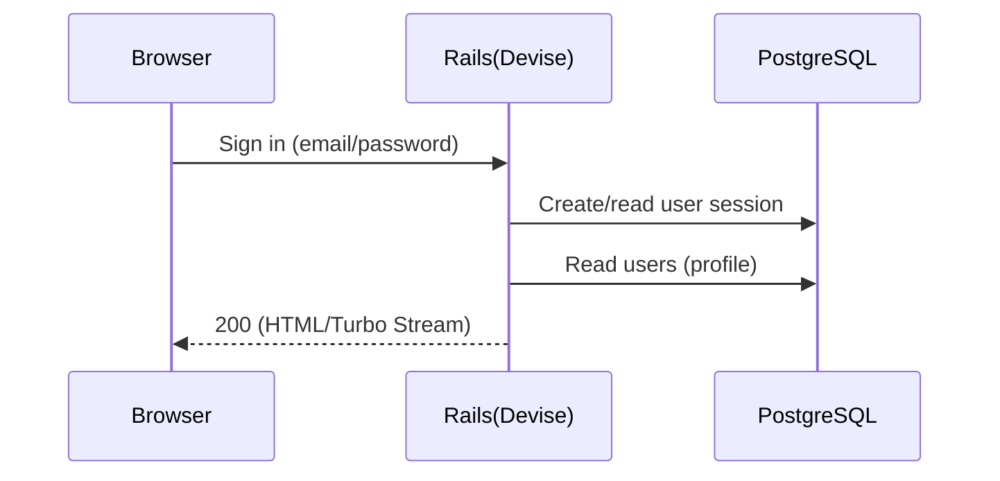
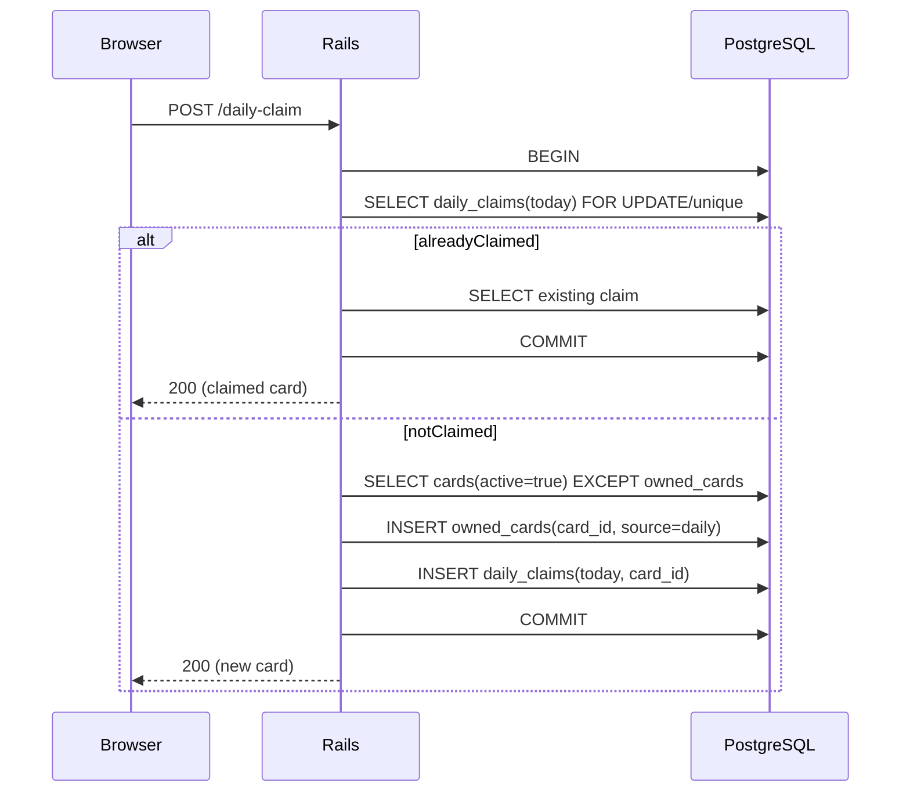
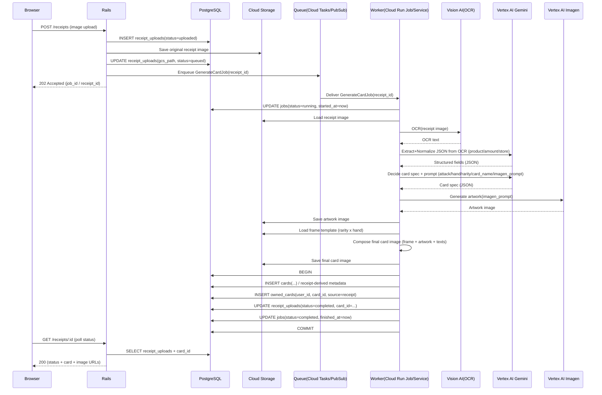

# アーキテクチャ（MVP + 将来オンライン拡張）

このドキュメントは「MVP（CPU戦 + コレクション + 日次報酬）」を **Railsモノリス + PostgreSQL** で実装する前提のアーキテクチャをまとめます。

## MVP構成（CPU戦 + コレクション + 日次報酬）

ポイント:
- **フロント/バックはRailsに統一**（ERB + Hotwire/Turboを基本にする）
- **バトル進行はクライアント中心**（CPU戦なので低レイテンシで完結。必要な整合性はサーバ側で検証）
- **所持カード・日次報酬はサーバで管理**（不正/多重受取対策）
- **認証はDevise**（MVPはEmail/Password等。将来はOAuth追加可）
- **データ永続はPostgreSQL**（カードマスタ/所持/ロードアウト/日次受取/将来の対戦ログ）
- **画像はActive Storage**（開発: ローカル、将来: GCS等に移行）

## 開発環境（ローカル）

リポジトリ構成:
- `rails/`: Railsアプリ本体
- `docker-compose.yml`, `Dockerfile`: 開発用のコンテナ環境（`rails/` をコンテナへマウント）

開発時は Docker Compose で Rails と PostgreSQL を立ち上げます。

```mermaid
flowchart TB
  dev[Developer] --> browser[Browser]
  browser --> web[Rails (Docker)]
  web --> db[(PostgreSQL (Docker))]
  dev -->|edit| src[./rails (bind mount)]
  src --> web
```

補足:
- `docker compose up` で `bundle install` → `db:prepare` → `rails server` を実行する想定（詳細は `README.md`）

## 本番（GCP想定）



## 主要データフロー

### サインイン〜プロフィール取得



### 日次報酬（揃うまで重複なし）



### レシートからカード生成（OCR + 生成AI + 画像合成）

要件（`docs/create-card.md`）:
- レシート画像から「商品名/金額/購入店舗」を抽出し、カード名（魔法っぽい）/攻撃力（20,30,40,50）/じゃんけん（グー,チョキ,パー）/画像（魔法を唱えている絵）を生成する
- 「レアリティ × じゃんけん」ごとの枠テンプレ画像に、生成アート＋テキストを合成して最終カード画像を作る
- 画像はGCSに保存し、同時にDBに所持カード情報を保存する

設計方針:
- 画像生成は時間がかかるため **非同期ジョブ** として実行（HTTPタイムアウト回避、再試行、冪等性）
- 抽出/生成は **Vertex AI（Gemini）** を中心に、OCRは **Vision AI** を併用
- 生成物（レシート原本/中間生成アート/最終カード）は **GCS** に保存（RailsはActive Storage経由でも可）



失敗時の扱い（最低限）:
- OCR/抽出/生成のどこで失敗したかを `jobs.last_error` 等に保存し、`status=failed` にする
- 一時障害（429/5xx）はジョブ基盤の再試行に任せる（最大回数/バックオフ）
- 冪等性: `receipt_id` をキーに「同じレシートからカードが二重生成されない」ようDBで一意制約/ロックを持つ

## MVPでの責務分割（実装の目安）

- **Rails（サーバ権威が必要なもの）**
  - 認証（セッション）
  - カードマスタ参照
  - 所持カード更新
  - 日次報酬（冪等 + 原子処理で多重受取防止）
  - ロードアウト保存（合計攻撃力<=100の検証）
- **ブラウザ（低レイテンシで完結するもの）**
  - CPU戦のターン進行/演出（必要なら結果だけ保存）

## 将来: オンライン対戦（リアルタイム）拡張案

オンライン化すると「ルーム状態の同期」「不正対策（サーバ権威）」「切断/再接続」が必要になります。
最初のMVP構成を壊さず足せる拡張として以下を想定します。

```mermaid
flowchart TB
  subgraph gcp [GCP]
    web[Rails Web App]
    battle[Battle Service]
    match[Matchmaking]
    db[(PostgreSQL / Cloud SQL)]
    redis[Memorystore(Redis)]
  end

  web -->|websocket/sse| battle
  web -->|api| match
  match --> db
  battle --> redis
  battle --> db
```

オンライン拡張で増える設計論点:
- **通信方式**: WebSocket / SSE / WebRTC（要件次第）
- **状態置き場**: DB（永続） + Redis（リアルタイム状態/ロック）
- **権威性**: サーバで手を受け取り、勝敗/ダメージ計算をサーバで確定

## 構成の補足（推奨のデプロイ形）

- **Rails（Web + API）**
  - **Cloud Run（コンテナ）** + Secret Manager + Cloud Logging
  - DBは **Cloud SQL(PostgreSQL)** を推奨
  - 画像は **Active Storage + Cloud Storage**（将来CDN追加も容易）

## 実行計画（レシート→カード生成をMVPに載せる）

この計画は「最短で動くもの」から順に積み上げ、後から品質（精度/コスト/安全性）を上げられるようにします。

### Phase 0: 仕様固定（半日〜1日）
- 認証方式の確定（このドキュメントはDevise前提だが、Firebase併用案も別ドキュメントに存在するためどちらかに寄せる）
- レシート抽出項目の定義（商品名/金額/店舗名のフォーマット、通貨、税込/税抜の扱い）
- カード生成ルールの固定（攻撃力: 20/30/40/50、レアリティ閾値、じゃんけん決定ロジック）
- 枠テンプレ画像の仕様（サイズ、セーフエリア、テキスト位置、フォント）

### Phase 1: 保存基盤（1〜2日）
- GCSバケット設計（`receipts/`, `artworks/`, `cards/`, `frames/` 等のプレフィックス）
- Active Storage をGCSに向ける（本番）/ ローカル（開発）を切り替え可能にする
- Cloud SQL接続、Secret Managerで鍵/設定を管理
- IAM最小権限（Cloud Run → GCS/Vertex/Vision へのアクセス）

### Phase 2: DB・API（1〜2日）
- `receipt_uploads`（原本パス/状態/ユーザー/生成結果参照）と `card_generation_jobs`（状態/エラー/再試行）を用意
- レシートアップロードAPI（作成→保存→ジョブ投入→202返却）
- ステータス照会API（ポーリングで `queued/running/failed/completed` を返す）

### Phase 3: OCR + 抽出（1〜3日）
- Vision AI OCRを組み込み、OCR結果を保存
- Gemini（Vertex）に **JSONスキーマ固定** で抽出させる（構造化出力、バリデーション）
- 抽出失敗時のフォールバック（再プロンプト/ルール抽出/人手リトライUIは将来でも可）

### Phase 4: アート生成 + 合成（2〜4日）
- Imagenでアート生成（安全設定、禁止語、画風の統一）
- 枠テンプレ（rarity×hand）を読み込み、画像合成（テキスト描画含む）で最終カードを生成
- 生成物（アート/最終カード）をGCSへ保存し、DBに `cards` と `owned_cards` を作成

### Phase 5: UI統合（1〜2日）
- アップロード画面（進捗表示: ポーリング）
- 生成結果（カード表示・コレクション反映）
- 失敗時の表示（再試行ボタン、問い合わせ用のジョブID表示）

### Phase 6: 運用・品質（継続）
- Cloud Logging/Error Reporting、メトリクス（成功率、平均生成時間、1生成あたりコスト）
- レート制限/不正対策（ユーザーあたり生成回数、同一画像の多重投入防止）
- プロンプト/モデル更新の管理（A/B、バージョニング、再現性のための入力/出力保存）

