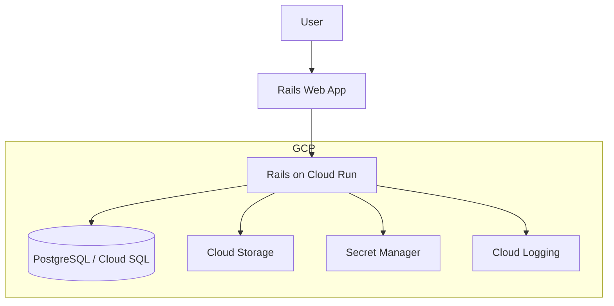
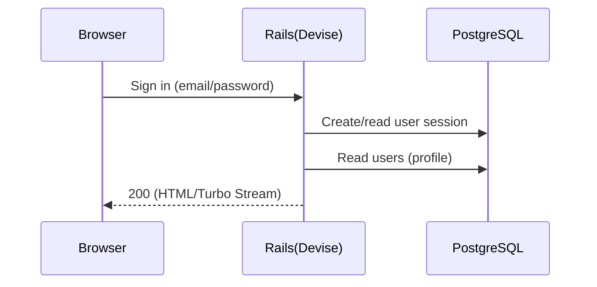
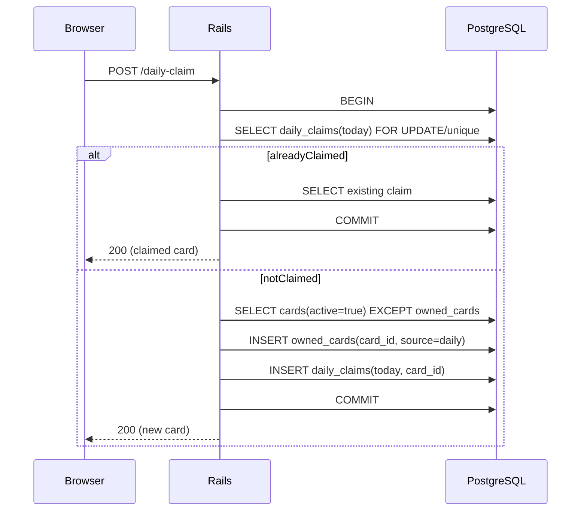

# アーキテクチャ（MVP + 将来オンライン拡張）

このドキュメントは「MVP（CPU戦 + コレクション + 日次報酬）」を **Railsモノリス + PostgreSQL** で実装する前提のアーキテクチャをまとめます。

## MVP構成（CPU戦 + コレクション + 日次報酬）

ポイント:
- **フロント/バックはRailsに統一**（ERB + Hotwire/Turboを基本にする）
- **バトル進行はクライアント中心**（CPU戦なので低レイテンシで完結。必要な整合性はサーバ側で検証）
- **所持カード・日次報酬はサーバで管理**（不正/多重受取対策）
- **認証はDevise**（MVPはEmail/Password等。将来はOAuth追加可）
- **データ永続はPostgreSQL**（カードマスタ/所持/ロードアウト/日次受取/将来の対戦ログ）
- **画像はActive Storage**（開発: ローカル、将来: GCS等に移行）

## 開発環境（ローカル）

リポジトリ構成:
- `rails/`: Railsアプリ本体
- `docker-compose.yml`, `Dockerfile`: 開発用のコンテナ環境（`rails/` をコンテナへマウント）

開発時は Docker Compose で Rails と PostgreSQL を立ち上げます。

```mermaid
flowchart TB
  dev[Developer] --> browser[Browser]
  browser --> web[Rails (Docker)]
  web --> db[(PostgreSQL (Docker))]
  dev -->|edit| src[./rails (bind mount)]
  src --> web
```

補足:
- `docker compose up` で `bundle install` → `db:prepare` → `rails server` を実行する想定（詳細は `README.md`）

## 本番（GCP想定）



## 主要データフロー

### サインイン〜プロフィール取得



### 日次報酬（揃うまで重複なし）



## MVPでの責務分割（実装の目安）

- **Rails（サーバ権威が必要なもの）**
  - 認証（セッション）
  - カードマスタ参照
  - 所持カード更新
  - 日次報酬（冪等 + 原子処理で多重受取防止）
  - ロードアウト保存（合計攻撃力<=100の検証）
- **ブラウザ（低レイテンシで完結するもの）**
  - CPU戦のターン進行/演出（必要なら結果だけ保存）

## 将来: オンライン対戦（リアルタイム）拡張案

オンライン化すると「ルーム状態の同期」「不正対策（サーバ権威）」「切断/再接続」が必要になります。
最初のMVP構成を壊さず足せる拡張として以下を想定します。

```mermaid
flowchart TB
  subgraph gcp [GCP]
    web[Rails Web App]
    battle[Battle Service]
    match[Matchmaking]
    db[(PostgreSQL / Cloud SQL)]
    redis[Memorystore(Redis)]
  end

  web -->|websocket/sse| battle
  web -->|api| match
  match --> db
  battle --> redis
  battle --> db
```

オンライン拡張で増える設計論点:
- **通信方式**: WebSocket / SSE / WebRTC（要件次第）
- **状態置き場**: DB（永続） + Redis（リアルタイム状態/ロック）
- **権威性**: サーバで手を受け取り、勝敗/ダメージ計算をサーバで確定

## 構成の補足（推奨のデプロイ形）

- **Rails（Web + API）**
  - **Cloud Run（コンテナ）** + Secret Manager + Cloud Logging
  - DBは **Cloud SQL(PostgreSQL)** を推奨
  - 画像は **Active Storage + Cloud Storage**（将来CDN追加も容易）

