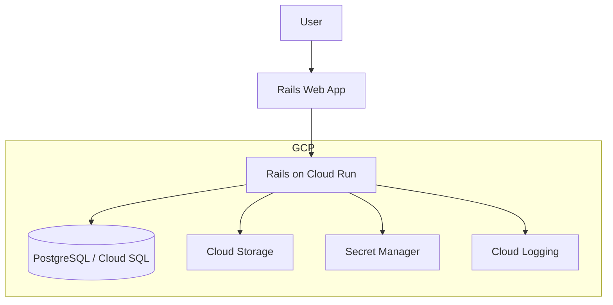
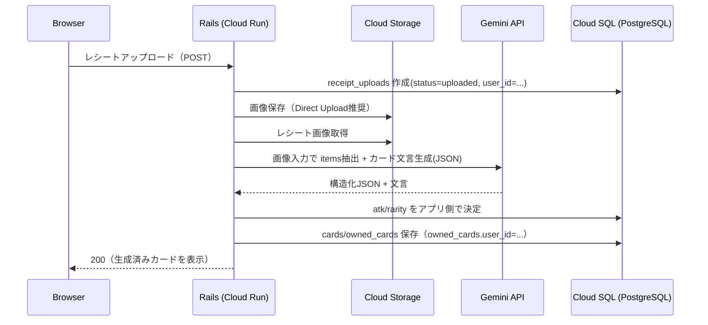
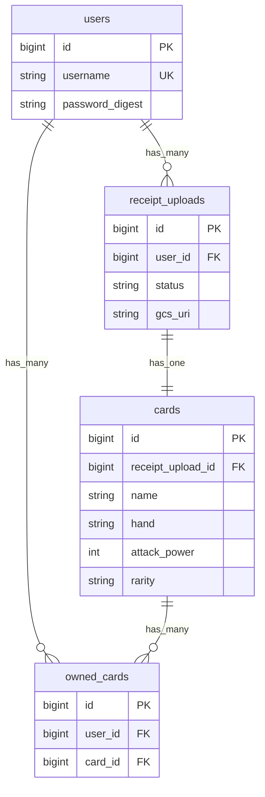
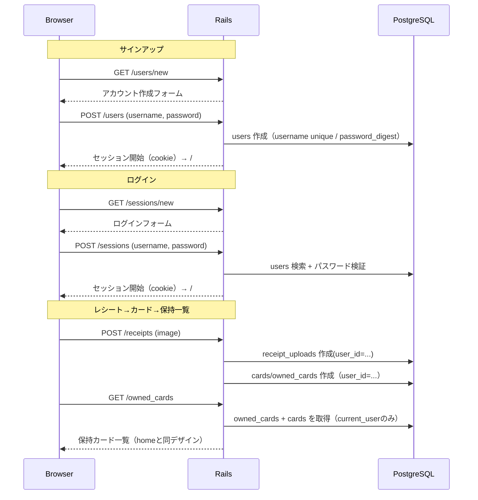

# アーキテクチャ（MVP + 将来オンライン拡張）

このドキュメントは「MVP（CPU戦 + コレクション + 日次報酬）」を **Railsモノリス + PostgreSQL** で実装する前提のアーキテクチャをまとめます。

## 開発環境（ローカル）

リポジトリ構成:
- `rails/`: Railsアプリ本体
- `docker-compose.yml`, `Dockerfile`: 開発用のコンテナ環境（`rails/` をコンテナへマウント）

開発時は Docker Compose で Rails と PostgreSQL を立ち上げます。

```mermaid
flowchart TB
  dev[Developer] --> browser[Browser]
  browser --> web[Rails (Docker)]
  web --> db[(PostgreSQL (Docker))]
  dev -->|edit| src[./rails (bind mount)]
  src --> web
```

補足:
- `docker compose up` で `bundle install` → `db:prepare` → `rails server` を実行する想定（詳細は `README.md`）

## 本番（GCP想定）



## 主要データフロー

### レシートからカード生成（OCR + 生成AI + 画像合成）

要件（`docs/create-card.md`）:

同期版（まずは全体を動かす、非同期なし）:
- **使うGCPサービスは1つだけ**: **Gemini API**
  - 画像（レシート）を入力として渡し、(1) 商品名・金額の抽出（OCR相当）と (2) カード文言（カード名/じゃんけん/説明）を **単一リクエストでJSON出力**させる
  - 生成出力は **JSONスキーマ固定**にして、Rails側でバリデーションして保存する
- **入口（アップロード）**: ブラウザ → Rails（Cloud Run）
  - Active Storage（本番は **GCS**）を使い、レシート画像を `<env>/receipts/` に保存（例: `development/receipts/`。可能なら **Direct Upload** でブラウザ→GCS、Railsはメタデータのみ受ける）export GEMINI_API_KEY="ここに発行したAPIキー"
# 任意（固定したい場合）
export GEMINI_MODEL="gemini-2.0-flash"

./rails/bin/deploy_cloud_run
  - DB（Cloud SQL）に `receipt_uploads` を作成してユーザーと紐づけて **先に保存**（要件どおり）
- **同期実行（同一HTTPリクエスト内）**:
  - RailsがGCS上のレシート画像を読み込み → Gemini APIへ送信 → 構造化JSONを受け取る
  - **攻撃力（20/30/40/50の重み付き）とレアリティ（20=ブロンズ/30=シルバー/40=ゴールド/50=レジェンド）** は不正/再現性の観点から **アプリ側で決定**（LLMには決めさせない）
  - `cards` / `owned_cards` を作成し、`receipt_uploads` を `completed` に更新（失敗時は `failed` とエラーメッセージを保存）
- **画像（カード画像）について（MVP割り切り）**:
  - 本来は「魔法を唱えている感のある正方形画像」を生成したいが、同期で全体を動かす最優先のため、まずは **プレースホルダ画像（固定アセット）** でカード画像生成/表示まで通す
  - 画像生成は、後で非同期化したタイミングで差し替える（将来: Imagen等）
- **運用（必須最小）**:
  - Secret Manager: Gemini APIキー等の秘匿
  - Cloud Logging / Error Reporting: 失敗原因の可観測性
  - レート制限: ユーザー単位の生成回数制限（コスト爆発と不正対策）

データフロー（例）:



### アカウント作成から保持カード確認まで

要件（`docs/create-account.md`）:

- ユーザー名 + パスワード（8文字以上）でアカウント作成
- 作成したアカウントでログイン状態にする
- すべてのページはログイン後にアクセスできる
- `/receipts/new` で作成したレシートアップロードをログインユーザーに紐づける
- 保持カード一覧を確認できるようにする（カードのデザインはhomeと同じ）

#### データモデル（最小）



#### 画面/リクエストフロー

