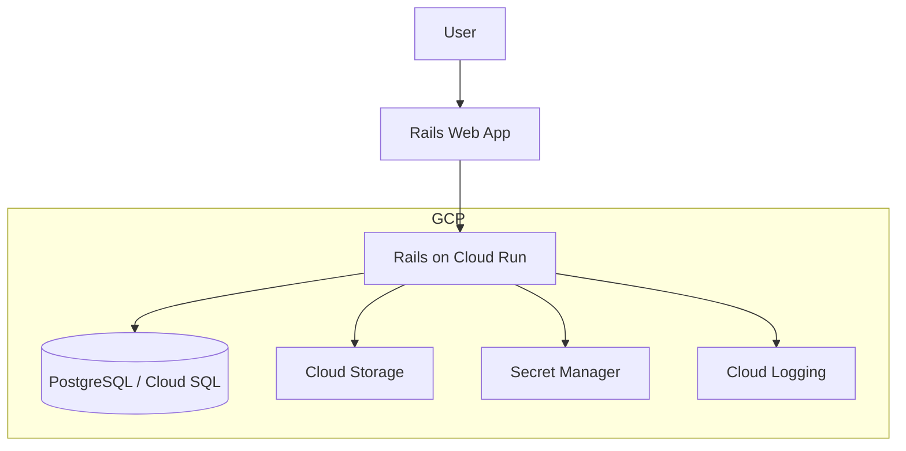
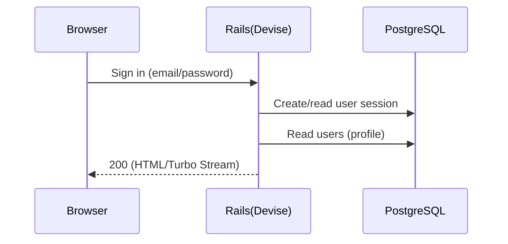
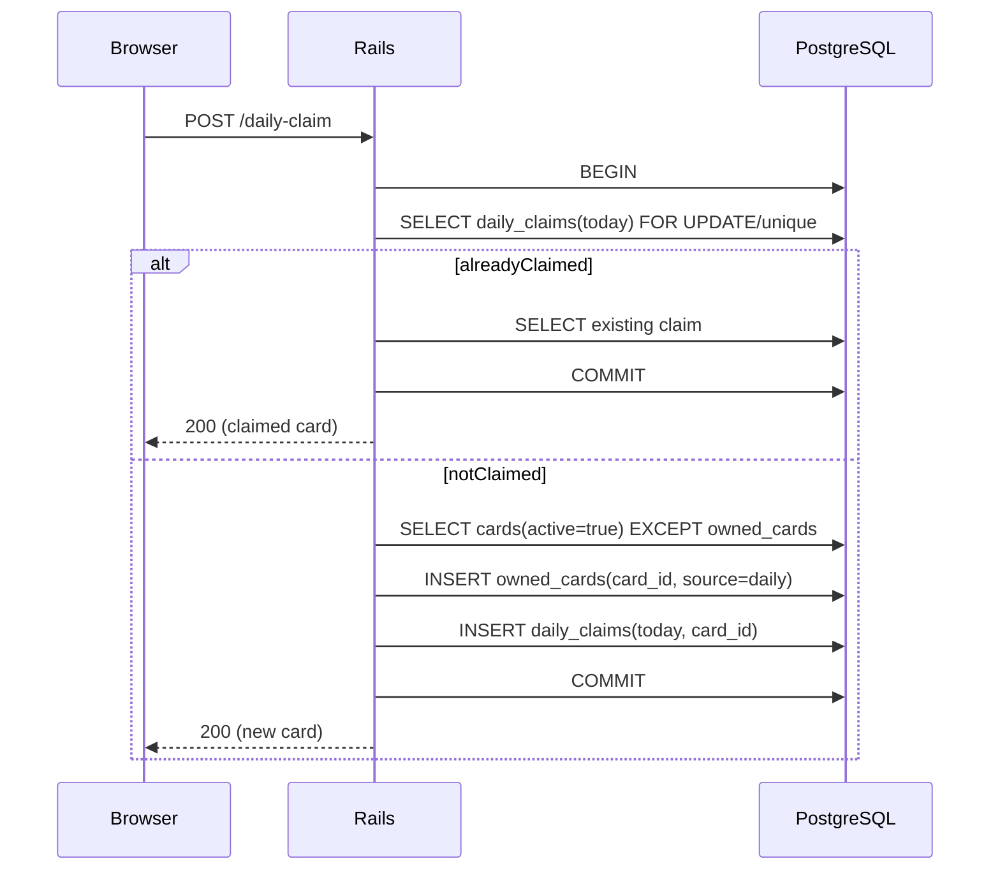

# アーキテクチャ（MVP + 将来オンライン拡張）

このドキュメントは「MVP（CPU戦 + コレクション + 日次報酬）」を **Railsモノリス + PostgreSQL** で実装する前提のアーキテクチャをまとめます。

## MVP構成（CPU戦 + コレクション + 日次報酬）

ポイント:
- **フロント/バックはRailsに統一**（ERB + Hotwire/Turboを基本にする）
- **バトル進行はクライアント中心**（CPU戦なので低レイテンシで完結。必要な整合性はサーバ側で検証）
- **所持カード・日次報酬はサーバで管理**（不正/多重受取対策）
- **認証はDevise**（MVPはEmail/Password等。将来はOAuth追加可）
- **データ永続はPostgreSQL**（カードマスタ/所持/ロードアウト/日次受取/将来の対戦ログ）
- **画像はActive Storage**（開発: ローカル、将来: GCS等に移行）

## 開発環境（ローカル）

リポジトリ構成:
- `rails/`: Railsアプリ本体
- `docker-compose.yml`, `Dockerfile`: 開発用のコンテナ環境（`rails/` をコンテナへマウント）

開発時は Docker Compose で Rails と PostgreSQL を立ち上げます。

```mermaid
flowchart TB
  dev[Developer] --> browser[Browser]
  browser --> web[Rails (Docker)]
  web --> db[(PostgreSQL (Docker))]
  dev -->|edit| src[./rails (bind mount)]
  src --> web
```

補足:
- `docker compose up` で `bundle install` → `db:prepare` → `rails server` を実行する想定（詳細は `README.md`）

## 本番（GCP想定）



## 主要データフロー

### サインイン〜プロフィール取得



### 日次報酬（揃うまで重複なし）



### レシートからカード生成（OCR + 生成AI + 画像合成）

要件（`docs/create-card.md`）:

同期版（まずは全体を動かす、非同期なし）:
- **使うGCPサービスは1つだけ**: **Gemini API**
  - 画像（レシート）を入力として渡し、(1) 商品名・金額の抽出（OCR相当）と (2) カード文言（カード名/じゃんけん/説明）を **単一リクエストでJSON出力**させる
  - 生成出力は **JSONスキーマ固定**にして、Rails側でバリデーションして保存する
- **入口（アップロード）**: ブラウザ → Rails（Cloud Run）
  - Active Storage（本番は **GCS**）を使い、レシート画像を `<env>/receipts/` に保存（例: `development/receipts/`。可能なら **Direct Upload** でブラウザ→GCS、Railsはメタデータのみ受ける）export GEMINI_API_KEY="ここに発行したAPIキー"
# 任意（固定したい場合）
export GEMINI_MODEL="gemini-2.0-flash"

./rails/bin/deploy_cloud_run
  - DB（Cloud SQL）に `receipt_uploads` を作成してユーザーと紐づけて **先に保存**（要件どおり）
- **同期実行（同一HTTPリクエスト内）**:
  - RailsがGCS上のレシート画像を読み込み → Gemini APIへ送信 → 構造化JSONを受け取る
  - **攻撃力（20/30/40/50の重み付き）とレアリティ（20=ブロンズ/30=シルバー/40=ゴールド/50=レジェンド）** は不正/再現性の観点から **アプリ側で決定**（LLMには決めさせない）
  - `cards` / `owned_cards` を作成し、`receipt_uploads` を `completed` に更新（失敗時は `failed` とエラーメッセージを保存）
- **画像（カード画像）について（MVP割り切り）**:
  - 本来は「魔法を唱えている感のある正方形画像」を生成したいが、同期で全体を動かす最優先のため、まずは **プレースホルダ画像（固定アセット）** でカード画像生成/表示まで通す
  - 画像生成は、後で非同期化したタイミングで差し替える（将来: Imagen等）
- **運用（必須最小）**:
  - Secret Manager: Gemini APIキー等の秘匿
  - Cloud Logging / Error Reporting: 失敗原因の可観測性
  - レート制限: ユーザー単位の生成回数制限（コスト爆発と不正対策）

データフロー（例）:


## MVPでの責務分割（実装の目安）

- **Rails（サーバ権威が必要なもの）**
  - 認証（セッション）
  - カードマスタ参照
  - 所持カード更新
  - 日次報酬（冪等 + 原子処理で多重受取防止）
  - ロードアウト保存（合計攻撃力<=100の検証）
- **ブラウザ（低レイテンシで完結するもの）**
  - CPU戦のターン進行/演出（必要なら結果だけ保存）

## 将来: オンライン対戦（リアルタイム）拡張案

オンライン化すると「ルーム状態の同期」「不正対策（サーバ権威）」「切断/再接続」が必要になります。
最初のMVP構成を壊さず足せる拡張として以下を想定します。

```mermaid
flowchart TB
  subgraph gcp [GCP]
    web[Rails Web App]
    battle[Battle Service]
    match[Matchmaking]
    db[(PostgreSQL / Cloud SQL)]
    redis[Memorystore(Redis)]
  end

  web -->|websocket/sse| battle
  web -->|api| match
  match --> db
  battle --> redis
  battle --> db
```

オンライン拡張で増える設計論点:
- **通信方式**: WebSocket / SSE / WebRTC（要件次第）
- **状態置き場**: DB（永続） + Redis（リアルタイム状態/ロック）
- **権威性**: サーバで手を受け取り、勝敗/ダメージ計算をサーバで確定

## 構成の補足（推奨のデプロイ形）

- **Rails（Web + API）**
  - **Cloud Run（コンテナ）** + Secret Manager + Cloud Logging
  - DBは **Cloud SQL(PostgreSQL)** を推奨
  - 画像は **Active Storage + Cloud Storage**（将来CDN追加も容易）

## 実行計画（レシート→カード生成をMVPに載せる）

この計画は「最短で動くもの」から順に積み上げ、後から品質（精度/コスト/安全性）を上げられるようにします。

### Phase 0: 仕様固定（半日〜1日）
- 認証方式の確定（このドキュメントはDevise前提だが、Firebase併用案も別ドキュメントに存在するためどちらかに寄せる）
- レシート抽出項目の定義（商品名/金額/店舗名のフォーマット、通貨、税込/税抜の扱い）
- カード生成ルールの固定（攻撃力: 20/30/40/50、レアリティ閾値、じゃんけん決定ロジック）
- 枠テンプレ画像の仕様（サイズ、セーフエリア、テキスト位置、フォント）

### Phase 1: 保存基盤（1〜2日）
- GCSバケット設計（環境プレフィックス込みで `<env>/receipts/`, `<env>/artworks/`, `<env>/cards/`。`frames/` は共通アセットとして環境分離しない運用も可）
- Active Storage をGCSに向ける（本番）/ ローカル（開発）を切り替え可能にする
- Cloud SQL接続、Secret Managerで鍵/設定を管理
- IAM最小権限（Cloud Run → GCS/Vertex/Vision へのアクセス）

### Phase 2: DB・API（1〜2日）
- `receipt_uploads`（原本パス/状態/ユーザー/生成結果参照）を用意（まずは **同期**で回すのでジョブテーブルは後回しでOK）
- レシートアップロードAPI（作成→保存→**同期生成**→200返却）
- 失敗時のハンドリング（`failed` とエラー保存、再試行ボタンは将来）

### Phase 3: 抽出 + 生成（Gemini API単独）（1〜3日）
- Gemini API に **画像（レシート）を入力**して、商品名/金額の抽出（OCR相当）とカード文言生成を **JSONスキーマ固定**で返させる
- Rails側でJSONをバリデーションし、`receipt_uploads` に監査用の入力/出力（例: `gemini_request`, `gemini_response`）を保存
- 攻撃力/レアリティは **アプリ側で決定**（確率重み付けもアプリ側）

### Phase 4: カード画像（MVPはプレースホルダで通す）（0.5〜1日）
- まずはプレースホルダ画像（固定アセット）を `cards` の表示に使い、全体フローを成立させる
- 後で画像生成を入れる前提で、画像ファイル名（GCSのオブジェクトキー）をDBに保持する設計だけは先に揃える

### Phase 5: UI統合（1〜2日）
- アップロード画面（進捗表示: ポーリング）
- 生成結果（カード表示・コレクション反映）
- 失敗時の表示（再試行ボタン、問い合わせ用のジョブID表示）

### Phase 6: 運用・品質（継続）
- Cloud Logging/Error Reporting、メトリクス（成功率、平均生成時間、1生成あたりコスト）
- レート制限/不正対策（ユーザーあたり生成回数、同一画像の多重投入防止）
- プロンプト/モデル更新の管理（A/B、バージョニング、再現性のための入力/出力保存）

### 将来（必要になったら）: 非同期化
- 同期でのタイムアウト/コスト/UXが問題になった段階で、Pub/Sub + ワーカー（Cloud Run）に分離して非同期化する
- このとき初めてジョブテーブル（状態/再試行/冪等キー）と、結果ポーリング（または通知）を導入する

